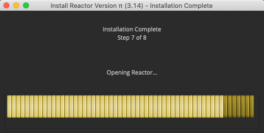
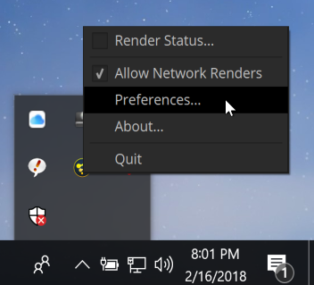
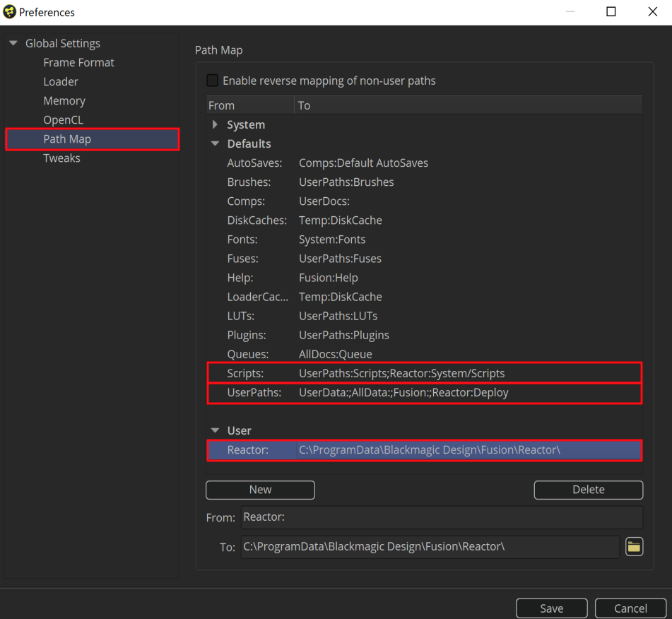
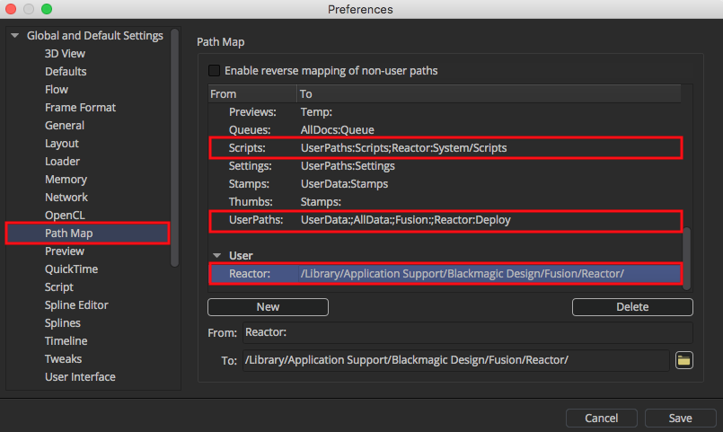

# Table Of Contents #

- [Installing Reactor](Installing-Reactor.md#installing-reactor)
	- [Installing Reactor Visually](Installing-Reactor.md#installing-reactor-visually)
	- [Installing Reactor Manually](Installing-Reactor.md#installing-reactor-manually)
	- [Using Reactor Content on a Render Node](Installing-Reactor.md#using-reactor-content-on-a-rendernode)
		- [Fusion Render Node Preference File](Installing-Reactor.md#fusion-render-node-preference-file)
	- [Uninstalling Reactor Manually](Installing-Reactor.md#uninstalling-reactor-manually)

# Installing Reactor #

## Installing Reactor Visually ##

The `Reactor-Installer.lua` script makes it quick and easy to set up Reactor.

**Step 1.** Drag the Reactor-Installer.lua script from your desktop into the Fusion Console tab to run it. Alternatively, you can also copy/paste the script into the Console text entry area to run it. An Install Reactor window will open. 

**Step 2.** Click the "Install and Relaunch" button. After a few seconds the Reactor Installer progress bar will appear and the installation will proceed.

A Reactor.fu file will be downloaded from the Reactor GitLab repository and is saved to the Fusion user prefs location at `Config:/Reactor.fu`. The GitLab repository address string is then written into a new `AllData:Reactor:/System/Reactor.cfg` file that is used to control what GitLab repositories are used with Reactor.

When the installer finishes, Fusion will restart automatically and the Reactor Package Manager will be displayed.

## Installing Reactor Manually ##

If you are a studio system admin/pipeline TD and need more control over the Reactor install process you can manually download files from the GitLab repo and install the tool by yourself.

Step 1. To install Reactor, download "Reactor.fu" and place it in your Fusion `Config:/` directory.

Windows `Config:/` Installation Path:

`%appdata%\Blackmagic Design\Fusion\Config\Reactor.fu`

Mac `Config:/` Installation Path:

`$HOME/Library/Application Support/Blackmagic Design/Fusion/Config/Reactor.fu`

Linux `Config:/` Installation Path:

`$HOME/.fusion/BlackmagicDesign/Fusion/Config/Reactor.fu`

Note: `$HOME` represents your current user account's home folder.

Step 2. The next time Fusion is launched a new "Reactor" menu will be added. Selecting the Reactor > Open Reactor... menu item will open the "Fusion Reactor" Package Manager window.

## Using Reactor Content on a Render Node ##

You can use your Reactor installed content on your render nodes so they have the exact same fuses and plugins installed as your Fusion Studio based workstations have.

This is done by opening the Fusion Render Node's preferences up and setting your PathMaps to match what you have configured on your own workstation's Fusion Studio PathMap preferences so they are 1:1 identical.

This means you should re-create the Fusion Studio style PathMap settings like this on each of your render nodes:

### **User** PathMap Entry ###

**From:**

`Reactor:`

**To:**

`C:\ProgramData\Blackmagic Design\Fusion\Reactor\`

If you have moved Reactor to a new installation location on your network share you would change the "To" section entry to point to that custom location you have placed the files at. This would be the folder you have set in your "`REACTOR_INSTALL_PATHMAP`" environment variable.

### **Defaults** PathMap Entry ###

**From:**

`UserPaths:`

**To:**

`UserData:;AllData:;Fusion:;Reactor:Deploy`

The `UserPaths:` section is where you define the folders that hold your fusion user preferences. Each PathMap location you define here will have a full set of sub-folders created during Fusion or Fusion Render Node's startup for holding the custom addons you can use with Fusion like:

- Bins
- Brushes
- Config
- Defaults
- Filters
- Fuses
- Guides
- Layouts
- Library
- LUTs
- Macros
- Modules
- Plugins
- Scripts
- Settings
- Stamps

### Optional Extra PathMap Entry ###

This extra setting can be configured on a render node if you want to be very thorough with your install. It is not strictly required but is a good idea to have for the future as this setting will become useful a few months from now when more Lua/Python scripted features and atoms are added to the toolset.

**From:**

`Scripts:`

**To:**

`UserPaths:Scripts;Reactor:System/Scripts`

### Fusion Render Node Preference File ###

The Fusion Render Node preference file has the filename of `RenderNode.prefs` that is located on your system in this PathMap folder:

`Profile:/`

On Windows this works out to:

`%AppData%\Blackmagic Design\Fusion\Profiles\Default\`

On Linux this works out to:

`$HOME/.fusion/BlackmagicDesign/Fusion/Profiles/Default/`

On MacOS this works out to:

`$HOME/Library/Application Support/Blackmagic Design/Fusion/Profiles/Default/`

## Uninstalling Reactor Manually ##

Step 1. To uninstall Reactor from your system you need to remove the downloaded Reactor "atom" content by deleting the Reactor folder that is located in your shared Fusion `AllData:/Reactor:/` folder. 

The `AllData:/Reactor:/` folder is located here:

**Windows Reactor Path:**

`C:\ProgramData\Blackmagic Design\Fusion\Reactor\`

**Mac Reactor Path:**

`/Library/Application Support/Blackmagic Design/Fusion/Reactor/`

**Linux Reactor Path:**

`/var/BlackmagicDesign/Fusion/Reactor/`

Step 2. You should also remove the `Reactor.fu` file from your Fusion user preferences `Config:/` directory. This will stop the Reactor menu item from being added to Fusion.

Step 3. Open the Fusion Preferences window and switch to the "Global and Default Settings > PathMap" section.

In the "User" section of the PathMap view click on the entry for the "Reactor:" PathMap. Then press the Delete button.

Scroll up to the "Defaults" section and click on the "UserPaths:" entry. Edit the text in the "To" field and remove the words ";Reactor:Deploy". Be sure to keep the rest of the settings in textfield.

Scroll up in the "Defaults" section and click on the "Scripts:" entry. Edit the text in the "To" field and remove the words ";Reactor:System/Scripts". Be sure to keep the rest of the settings that are in textfield.

Step 4. Restart Fusion. Reactor will have been cleanly removed from your system.

Last Revised 2018-02-25
