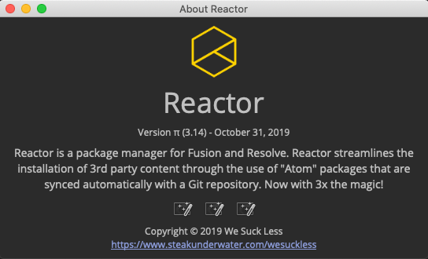
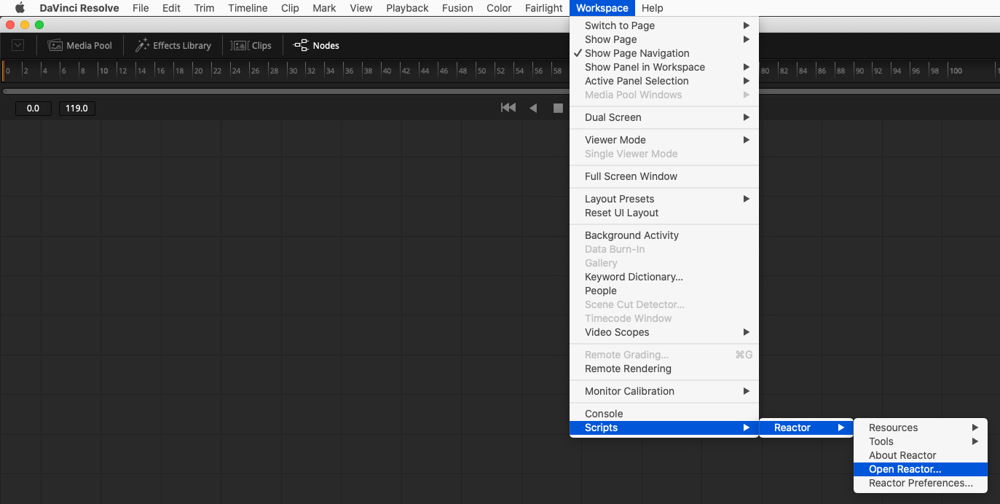
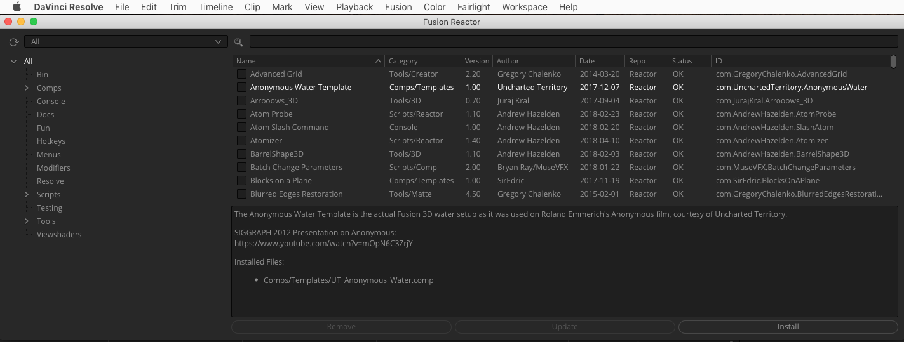
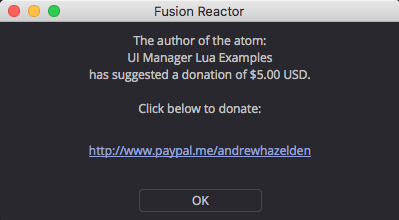
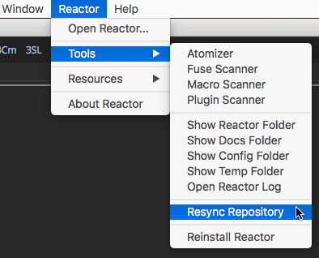
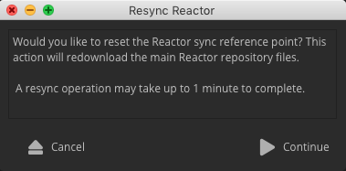

# Table Of Contents #

- [Using Reactor](Using-Reactor.md#using-reactor)
	- [Overview](Using-Reactor.md#overview)
	- [Opening Reactor Window](Using-Reactor.md#opening-reactor-window)
	- [Using the Reactor Package Manager](Using-Reactor.md#using-the-reactor-package-manager)
	- [Installing Atom Packages](Using-Reactor.md#installing-atom-packages)
	- [Updating Atom Packages](Using-Reactor.md#updating-atom-packages)
	- [Removing Atom Packages](Using-Reactor.md#removing-atom-packages)
		- [Removing Plugins on Windows](Using-Reactor.md#removing-plugins-on-windows)
	- [Searching for Atom Packages](Using-Reactor.md#searching-for-atom-packages)
	- [Reactor Categories Explained](Using-Reactor.md#reactor-categories-explained)
	- [Resync Repository](Using-Reactor.md#resync-repository)
		- [What is a PrevCommitID Value](Using-Reactor.md#what-is-a-prevcommitid-value)

# Using Reactor #

## Overview ##

Reactor is a package manager created by the [We Suck Less Community](https://www.steakunderwater.com/wesuckless/viewforum.php?f=32) for Fusion and Resolve. Reactor streamlines the installation of 3rd party content through the use of "Atom" packages that are synced automatically with a Git repository.

## Opening Reactor Window ##

After you have [installed Reactor](Installing-Reactor.md#installing-reactor) in Fusion/Resolve you can access the Reactor window using the **Reactor > Open Reactor...** menu item.

**Reactor for Fusion**:

**Reactor for Resolve**:

# Using the Reactor Package Manager #

The Reactor window shows a view filled with the atom packages that can be installed. This is a big list that shows everything that is included in the Reactor package manager's GitLab repository. This list runs into the hundreds of atom packages you can browse through.

If you want to find specific content by type, you can use the category section on the left side of the Reactor window to narrow down the list. If you want to find Macros, Fuses, or Plugins you could click on the `Tools` section. If you are looking for Lua or Python scripts check out the `Scripts` section. There are example Fusion composites and templates that can be found in the `Comps` section.

The column headings in the main view can be clicked on if you want to sort the list of atoms. This allows you to sort the available content by topics like `Name`, `Category`, `Author`, `ID`, `Date`, or `ID`. If you click on a heading multiple times the list will be sorted alphabetically by ascending or descending order.

As an example of this heading sorting approach, if you wanted to see the newest packages that were recently added to or updated in Reactor, click on the `Date` heading. The `Status` heading provides a quick indication if an atom is compatible with your current Fusion/Resolve version and operating system platform.

There is a search field at the top center of the Reactor window that can be used to search for specific content in Reactor.

When you click on an atom package in the list view the atom's description text will be shown in the lower part of the window. This description text will give you a summary of what the package does, a list of the files that will be installed, and an indication if the atom is compatible with your copy of Fusion/Resolve.

Atom packages are able to [define a suggested donation amount](Creating-Atom-Packages.md#adding-a-required-donation-to-an-atom-package) that is due to the author if you use the item. A dialog window will pop-up when you go to install or update an atom that has a donation value defined. This dialog allows you to contribute to that person by clicking on the link and going to the suggested internet URL such as PayPal, a custom webpage, or an email address link.

This is a preview of a PayPal.me based donation link shown by a Reactor atom package:

## Installing Atom Packages ##

To install an atom package on your computer you simply have to select the item you want to use in the Reactor list view. Then press the `Install` button at the bottom right corner of the window.

The selected atom package will then be downloaded from the Reactor GitLab repository and installed into your `Reactor:/Deploy/` PathMap based folder in Fusion/Resolve. If the atom you are installing includes a `.fuse`, `.fu`, or `.plugin` file you will need to restart Fusion/Resolve for it to become available.

An atom package can also add supporting items that are required for the content to work through the use of a `dependencies` entry in the atom file. This means a Macro `.setting` file, or an example Fusion composite that is delivered by Reactor is capable of adding any extra elements like a fuse or plugin that might be needed if that add-on is also accesible inside of Reactor. This `dependencies` feature is useful when you need a supporting `.fuse` like Cryptomatte, xf-chroma, KAK, or if you needed a plugin like Krokodove.

When an atom package is installed on your system you will see a white checkmark icon placed next to the atom's `Name` field in the list view.

Sometimes you can have duplicate items installed in Fusion/Resolve if you have previously added  3rd party content both manually and via Reactor. There is now a simple way to search for any of these duplicate files and assist you in the process of removing them. The Reactor bundled `Fuse Scanner` and `Plugin Scanner` scripts can be accessed in the **Reactor > Tools >** menu. These scripts will automatically find any of the fuse or plugin items that are present and work by scanning in all of the active Fusion PathMap locations on your system and then displays the results in a list. You can quickly sort the results in the view and see version, filename, and file path details.

It is possible to set up multiple GitLab repositories for use with Reactor. The Repository selector combo control at the top left of the Reactor window allows you to switch between a combined "All" view that lists every atom available from all of the active repositories, an "Installed" view that lists only the atoms that are currently installed on your system, and a "Reactor" view that lists the atoms that come from the main [WSL Reactor GitLab repository](https://gitlab.com/WeSuckLess/Reactor). If you have manually added additional Reactor repositories they would also show up in this combo control menu.

The Reactor repositories that are active on your system are configured in the `Reactor:/System/Reactor.cfg` file. When you go to edit the `Reactor.cfg` file in a programmer's text editor like **Notepad++** (Windows) / **BBEdit** (macOS) / **Gedit** (Linux) it is helpful to know that the file's language syntax is formatted like a Lua table structure.

## Updating Atom Packages ##

Reactor makes it simple to update an existing atom package that is installed on your system. Select the atom in the list view. Then press the `Update` button. The old item will be uninstalled from Fusion/Resolve, and then the newest version will be downloaded from the internet and installed.

If you need to update a Windows based Fusion plugin on your system that is write locked by Fusion, you should look at the tip in the [Removing Plugins on Windows](Using-Reactor.md#removing-plugins-on-windows) section of the Reactor documentation.

## Removing Atom Packages ##

To remove an existing atom package that is installed on your system, select the item in the list and then click the `Remove` button.

If the package you are removing has any `Dependencies` listed in the description field you can optionally decide to click on those items in Reactor and remove them manually as well.

After you remove an atom package from Reactor and then restart Fusion/Resolve you will notice the item is no longer visible in either the Fusion Bin Window / the Resolve Effects Library, or in the **Select Tool** window that is shown by pressing the **Control + Space** hotkey on Windows/Linux or the **Command + Space** hotkey on MacOS.

### Removing Plugins on Windows ###

There is an extra step required if you want to remove a compiled Fusion plugin on Windows.

While Fusion is running, plugin files are write protected by the Windows OS since they are considered "in-use". Please follow these steps if you want to update or remove Krokodove, VLAM, or similar compiled plugins:

**Step 1.** Use the **Reactor > Tools > Plugin Scanner** menu item to locate the installed plugin file on your system. Double click on the plugin name in the list to open an Explorer folder browsing view.

Alternatively, you can select the **Reactor > Tools > Show Reactor Folder** menu item. An Explorer folder browsing window will appear. Navigate to the `Reactor:/Deploy/Plugins/` folder using the Explorer folder browsing window.

**Step 2.** Quit Fusion so the plugin file is not write locked.

**Step 3.** Manually throw out the plugin file. If you wanted to remove an old Krokodove plugin you would look for an item named `Krokodove.plugin`.

At this point Fusion can be restarted and the new plugin can be installed using Reactor.

## Searching for Atom Packages ##

There is a search field at the top center of the Reactor window. It has a magnifying glass icon next to the text entry field. When you type text into the search field, the list of atoms is refreshed to show you the filtered search results. The title of the Reactor window will also update to indicate the content you are searching for.

You can search for the name of the atom, the author, the text in the description, any of the filenames in atom package, or even part of the filenames like searching by file extension. This search system allows you to easily search for specific items quickly such as typing in `.fuse` to find atom packages that include a fuse.

## Reactor Categories Explained ##

The Reactor window has a set of categories on the left side of the view that can be used to filter the atom packages that are displayed. Categories allow you to find specific content by type, which makes it easy to narrow down the list of atoms compared to having to scroll manually through hundreds of items.

If you want to find Macros, Fuses, or Plugins you could click on the `Tools` section. If you are looking for the Krokodove plugin, you would navigate to the **Tools > Plugins** category and then select "Krokodove".

If you are looking for Lua or Python scripts check out the `Scripts` section. There are example Fusion composites and templates that can be found in the `Comps` section.

If you are using Reactor inside of Resolve you can check out the special `Resolve` category that has a `Resolve Essentials` atom that will improve your productivity.

If you want to install some pipeline tools that have have been customized and packaged for use with Reactor check out the `Bin` category that has things like `ffmpeg`, `sqlite3`, `wintee`, and `Notepad++ for Fusion`.

The `Console` category has tools that work inside of the Fusion Console tab. These scripts are implemented using a feature called a Console Fuse and will act on the commands you type into the single line entry field in the Console.

The `Fun` category has some cute atom packages that can help you have some needless fun inside of Fusion/Resolve.

The `Menus` category works in Fusion 9 and allows you to add `Config:` based menu additions through the use of `.fu` files. These atoms add handy features like a `Restart Fusion` menu item, or menu entries for quickly closing all comps, or sending your current composite to a script editor too.

The `Hotkeys` category allows you to add `Config:` based hotkey additions through the use of `.fu` files. There is a `Nudge Playhead` atom that makes it easier to step between keyframes in your Fusion timeline.

The `viewshaders` category is where you can find special view LUTs that are implemented as either fuses or MacroLUTs. They can be used to modify how content is displayed in the viewer windows.

Here is a quick summary of the typical Reactor categories that are supported in a Reactor:

- Bin
- Brushes
- Comps
- Comps/Templates
- Console
- Docs
- Fun
- LUTs
- Menus
- Modifiers
- Modules
- Resolve
- Scripts
- Scripts/Bin
- Scripts/Comp
- Scripts/Job
- Scripts/Slave
- Scripts/Reactor
- Scripts/Tool
- Scripts/Utility
- Scripts/Views
- Testing
- Tools
- Tools/3D
- Tools/Color
- Tools/Composite
- Tools/Creator
- Tools/Effect
- Tools/Filter
- Tools/Flow
- Tools/Miscellaneous
- Tools/Optical Flow
- Tools/Particles
- Tools/Plugins
- Tools/Tracking
- Tools/Warp
- Viewshaders

## Resync Repository ##

The **Resync Repository** tool is used to reset the Reactor sync reference point. This action will redownload the main Reactor repository files. A resync operation may take up to 1 minute to complete. This process is useful if you have manually deleted .atom files from the `Reactor:/Atom/` folder and your Reactor package manager window is empty.

**Step 1.** Select the **Reactor > Tools > Resync Repository** menu item.

**Step 2.** A "Resync Repository" confirmation dialog will appear. Click the **Continue** button.

At this point your `Reactor:/System/Reactor.cfg` file's `PrevCommitID` entries will be reset. This causes Reactor to re-download all of the atom files from the Reactor repository. The Reactor package manager window will open automatically and start downloading the .atom files again from scratch to your `Reactor:/Atom/` folder.

### What is a PrevCommitID Value ###

The `PrevCommitID` entry is used by Reactor to save a record of the last differential sync point. This allows Reactor to download only the newest atom package files that were added to the GitLab repository since the last time you ran the Reactor package manager in Fusion/Resolve.

This is a preview of what a `Reactor:/System/Reactor.cfg` file looks like when a PrevCommitID value is present:

		{
			Repos = {
				GitLab = {
					Projects = {
						Reactor = "5058837"
					}
				}
			},
			Settings = {
				Reactor = {
					PrevCommitID = "ea2df981da1a98c4aecc1fac03d865fc16edd4a6",
					Token = ""
				}
			}
		}

The PrevCommitID value changes every time a new git commit is pushed to the Reactor online repository.

When you open the Reactor package manager window and a sync is performed the newest .atom files are downloaded to your system and the corresponding PrevCommitID value is updated.

Last Revised 2018-05-21
